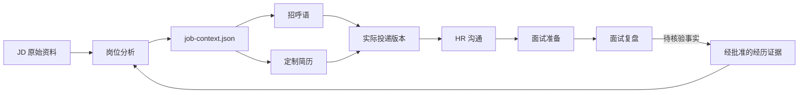

# Job Search Workbench

> 不再为同一个岗位反复“重新理解一遍”。用一份可追溯的岗位上下文，让岗位分析、招呼语、定制简历、HR沟通、面试准备与复盘始终说同一套真实故事。

[](https://github.com/openai/codex)
[](#隐私与事实边界)
[](https://www.python.org/)

Job Search Workbench 是一个面向真实求职流程的 Codex Skill。它把每个岗位当成一个持续更新的“小型项目”，而不是一次性生成一份简历：先建立统一的 `job-context.json`，再从同一组证据生成不同阶段需要的材料，并冻结实际投递版本。

## 为什么需要它

常见的求职 AI 工作流有三个隐蔽问题：

- 简历写了一套，BOSS 招呼语写了另一套，面试时又换了一套；
- JD 里的要求被误写成候选人已经具备的经历；
- 简历不断覆盖更新，收到面试后却找不到当时究竟投了哪一版。

这个 Skill 用“共享上下文 + 证据边界 + 版本冻结”解决这些问题。



## 一套工作台，覆盖整个求职周期

| 模式 | 你可以这样说 | Skill 会做什么 |
| --- | --- | --- |
| Analyze | “这个岗位值得投吗？” | 拆解硬门槛、匹配点、真实缺口与高价值问题 |
| Apply | “写招呼语和定制简历” | 生成共享分析、简短沟通文本和两页 HTML 简历 |
| Freeze | “这版已经投了” | 冻结实际发送话术、投递时间和简历版本 |
| Communicate | “HR 这样问怎么回复？” | 基于既有证据回复，并记录新增岗位信息 |
| Interview | “周三业务一面，帮我准备” | 使用真实投递版和最新沟通信息进入面试准备 |
| Review | “复盘这次面试录音” | 提取问题、表达短板、风险措辞和待核验新事实 |

## 核心能力

- **一次分析，多处复用**：招呼语、简历、HR 回复和面试回答共享同一岗位上下文。
- **证据优先**：明确区分 `Strong`、`Transferable` 和 `Gap`，不把 JD 要求伪装成个人经历。
- **归因不膨胀**：区分独立负责、共同负责、参与推动和团队结果。
- **投递版本可追溯**：草稿与实际投递版本分离，后续准备以真正发出的材料为准。
- **完整岗位档案**：保存多张 JD 截图、HTML 简历、独立样式、匹配分析、沟通记录和面试入口。
- **阶段化工作量**：没有面试时不生成沉重手册；确认面试后再进入完整准备。
- **自动检查**：检查简历页数、A4 尺寸、独立教育区块、招呼语长度和岗位档案一致性。

## 快速开始

### 1. 安装

```bash
git clone https://github.com/qinkio/job-search-workbench.git
mkdir -p ~/.codex/skills
cp -R job-search-workbench/job-search-workbench ~/.codex/skills/
```

重新打开 Codex 或开始一个新任务，即可使用 `$job-search-workbench`。

### 2. 创建本地配置

```bash
cp ~/.codex/skills/job-search-workbench/references/local-config.example.md \
   ~/.codex/skills/job-search-workbench/references/local-config.md
```

在 `local-config.md` 中填写你自己的职业资产路径、归档路径、简历规则和事实边界。该文件已被设计为只保留在本机，不应提交到 Git。

### 3. 开始使用

```text
使用 $job-search-workbench，分析这份 JD 是否值得投；
如果建议投递，生成 BOSS 招呼语、两页 HTML 定制简历并建立岗位档案。
```

收到招聘方回复后，不必重新提供全部背景：

```text
HR 问我是否有这个行业经验，该怎么回复？把沟通记录追加到对应岗位档案。
```

确认面试后：

```text
我周三下午业务一面。请基于实际投递版简历、完整 JD 和 HR 沟通记录准备面试。
```

## 每个岗位会得到什么

```text
YYYY-MM-DD_公司_岗位/
├── JD/                       # 原始截图、补充说明与后续变更
├── 岗位记录.md               # 当前状态、材料入口、下一步
├── 岗位分析.md               # 匹配点、缺口、风险、待确认问题
├── job-context.json          # 跨阶段复用的机器上下文
├── 简历/
│   ├── 候选人-岗位-v1.html
│   ├── 实际投递版.pdf
│   └── styles/resume.css
├── 沟通/HR沟通记录.md
└── 面试/
    ├── 面试准备.md
    ├── 快速复习卡.md
    └── 面试复盘.md
```

文件只会按当前阶段创建。没有确认投递，就不会把草稿标记成“已投递”；没有确认面试，也不会提前制造一整套空泛问答。

## 自动检查

初始化岗位档案：

```bash
python3 job-search-workbench/scripts/init_job_package.py \
  --root /absolute/path/to/job-archive \
  --company "示例公司" \
  --role "平台运营" \
  --candidate-name "候选人" \
  --jd /absolute/path/to/jd-01.png \
  --jd /absolute/path/to/jd-02.png
```

检查申请材料：

```bash
python3 job-search-workbench/scripts/validate_application.py \
  /absolute/path/to/resume.html \
  --greeting-file /absolute/path/to/greeting.txt \
  --pdf /absolute/path/to/resume.pdf
```

检查岗位档案：

```bash
python3 job-search-workbench/scripts/validate_job_package.py \
  /absolute/path/to/job-folder
```

结构校验不等于事实核验。指标、所有权和公开权限仍需候选人确认。

## 与其他 Skill 配合

- [`prepare-interview-pack`](https://github.com/qinkio/prepare-interview-pack)：确认面试后生成完整面试手册、快速复习卡与练习计划。
- `career-proof`：如果本机已安装，可提供最小化、用途受限的经历证据包；没有安装时，也可以使用经过本人确认的简历与项目材料。

Job Search Workbench 负责阶段路由、共享上下文和档案生命周期，不重复实现完整面试手册或职业资产库。

## 隐私与事实边界

这个仓库只包含规则、模板和检查脚本，不包含作者或使用者的：

- 姓名、电话、邮箱、薪资底线和本机绝对路径；
- 真实简历、JD 截图、聊天记录、面试录音和职业资产；
- 公司内部指标、客户信息、商业材料或未经批准的项目证据。

同时遵守以下原则：

- JD 是招聘方信息，不是候选人经历；
- 只有证据明确时才使用“负责”“主导”等所有权措辞；
- 不把正在学习写成已经掌握；
- 不把团队结果自动包装成个人结果；
- 不自动投递、不自动发送消息，也不替用户改变岗位状态。

## 仓库结构

```text
job-search-workbench/
├── README.md
└── job-search-workbench/
    ├── SKILL.md
    ├── agents/openai.yaml
    ├── assets/
    ├── references/
    └── scripts/
```

## 当前状态

当前版本已覆盖从 JD 判断到面试复盘的完整生命周期，并为申请材料和岗位档案提供确定性校验。后续计划包括更多匿名化示例、英文招聘平台文案模板和跨岗位投递效果汇总。

如果你也遇到“AI 写得很像，但每个阶段说法都不一致”的问题，欢迎试用、提出 Issue，或贡献更可靠的求职工作流。
